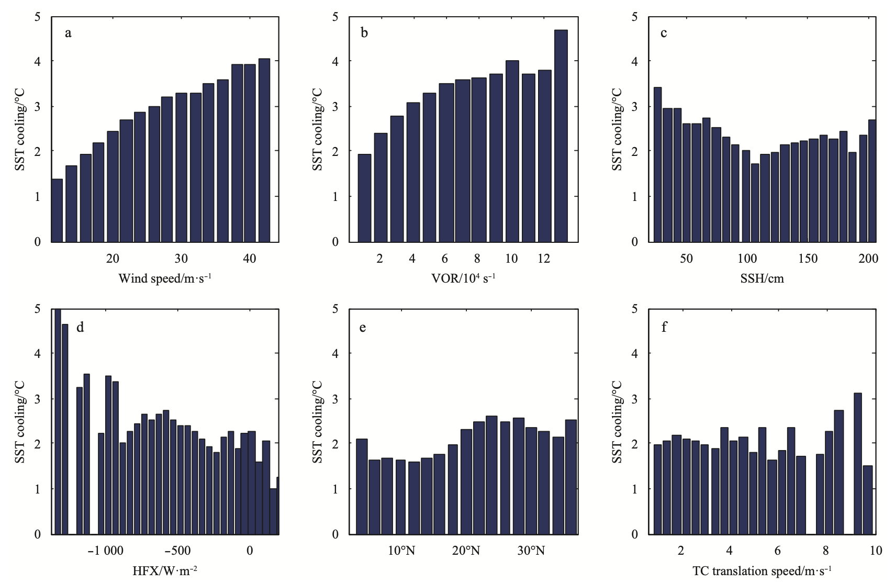
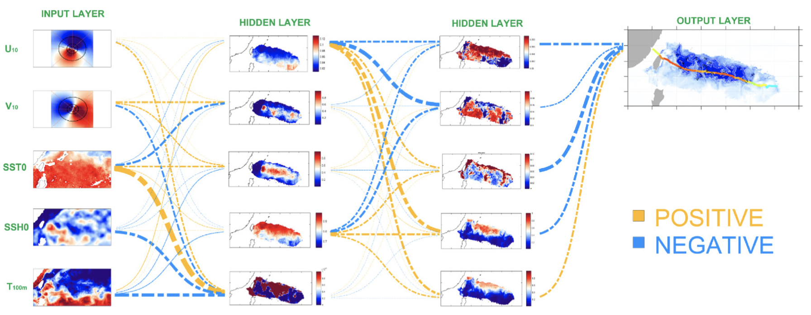

Guo-qing Jiang
============

----

>  
>  I am currently a Assistant Research Scientist at Chinese Meteorology Bureau. Before that, I was a [KUAI Tec.](https://www.kuaishou.com/) AI Algorithm Engineer working on understanding deep learning, face locallization, etc...

> On top of my research, I work on a number of side projects in climate change, physic ocean, and CS. They usually involve coding in Python, Fortran and Pytorch. My detailed education and experience can be found in [LinkedIn](https://www.linkedin.com/in/guoqing-jiang-780a5bb2/).

> 
[GitHub](https://github.com/Ageliss) / [LinkedIn](https://www.linkedin.com/in/guoqing-jiang-780a5bb2/) / [GoogleScholar](https://scholar.google.com/citations?user=kCBHjI4AAAAJ&hl=en) / [ResearchGate](https://www.researchgate.net/profile/Guo_Qing_Jiang) 

----

<!-- Education
---------

2010-2014 (expected)
:   **PhD, Computer Science**; Awesome University (MyTown)

    *Thesis title: Deep Learning Approaches to the Self-Awesomeness
     Estimation Problem*

2007-2010
:   **BSc, Computer Science and Electrical Engineering**; University of
    HomeTown (HomeTown)

    *Minor: Awesomeology*

Experience
----------

**Your Most Recent Work Experience:**

Short text containing the type of work done, results obtained,
lessons learned and other remarks. Can also include lists and
links:

* First item

* Item with [link](http://www.example.com). Links will work both in
  the html and pdf versions.

**That Other Job You Had**

Also with a short description.

Technical Experience
--------------------

My Cool Side Project
:   For items which don't have a clear time ordering, a definition
    list can be used to have named items.

    * These items can also contain lists, but you need to mind the
      indentation levels in the markdown source.
    * Second item.

Open Source
:   List open source contributions here, perhaps placing emphasis on
    the project names, for example the **Linux Kernel**, where you
    implemented multithreading over a long weekend, or **node.js**
    (with [link](http://nodejs.org)) which was actually totally
    your idea...

Programming Languages
:   **first-lang:** Here, we have an itemization, where we only want
    to add descriptions to the first few items, but still want to
    mention some others together at the end. A format that works well
    here is a description list where the first few items have their
    first word emphasized, and the last item contains the final few
    emphasized terms. Notice the reasonably nice page break in the pdf
    version, which wouldn't happen if we generated the pdf via html.

:   **second-lang:** Description of your experience with second-lang,
    perhaps again including a [link] [ref], this time placing the url
    reference elsewhere in the document to reduce clutter (see source
    file). 

:   **obscure-but-impressive-lang:** We both know this one's pushing
    it.

:   Basic knowledge of **C**, **x86 assembly**, **forth**, **Common Lisp**

[ref]: https://github.com/githubuser/superlongprojectname -->

Research:
----------------------------------------
I'm interested in AI, climate science and physical ocean. My current focus is on deep learning theory and applying deep learning methods to the climate-ocean models.

3.[A deep learning algorithm of neural network for the parameterization of typhoon‐ocean feedback in typhoon forecast models](https://agupubs.onlinelibrary.wiley.com/doi/abs/10.1002/2018GL077004)

**Guo‐Qing Jiang**, Jing Xu, Jun Wei (2018)

Two algorithms based on machine learning neural networks are proposed—the shallow learning (S‐L) and deep learning (D‐L) algorithms—that can potentially be used in atmosphere‐only typhoon forecast models to provide flow‐dependent typhoon‐induced sea surface temperature cooling (SSTC) for improving typhoon predictions. 

Accepted for publication in [Geophysical Research Letters](https://agupubs.onlinelibrary.wiley.com/journal/19448007)
 
 
 

2.[Parameterizing sea surface temperature cooling induced by tropical cyclones using a multivariate linear regression model](https://link.springer.com/article/10.1007/s13131-018-1153-0)

Jun Wei, Xin Liu, **Guoqing Jiang** (2018)

Combining a linear regression and a temperature budget formula, a multivariate regression model is proposed to parameterize and estimate sea surface temperature (SST) cooling induced by tropical cyclones (TCs).

Accepted for publication in [Acta Oceanologica Sinica](https://link.springer.com/journal/13131)
 
 
 

1.[Parameterization of typhoon-induced ocean cooling using temperature equation and machine learning algorithms: an example of typhoon Soulik (2013)](https://link.springer.com/article/10.1007/s10236-017-1082-z)

J Wei, **GQ Jiang**, X Liu (2017)

This study proposed three algorithms that can poten- tially be used to provide sea surface temperature (SST) condi- tions for typhoon prediction models.

Accepted for publication in [Ocean Dynamics](https://link.springer.com/journal/10236)
 
 
 

<!-- * Human Languages:

     * English (native speaker)
     * ???
     * This is what a nested list looks like.

* Random tidbit

* Other sort of impressive-sounding thing you did -->

----

> Contact me: <jianggq@pku.edu.cn>
